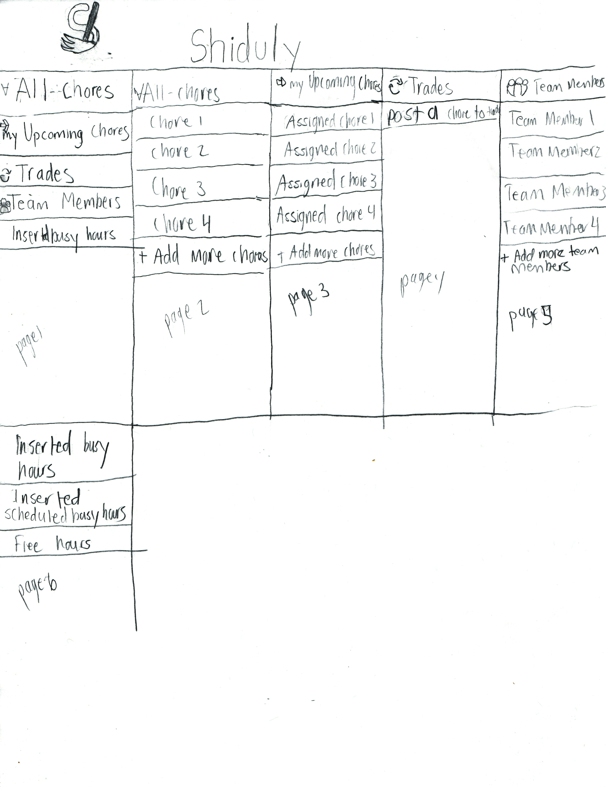
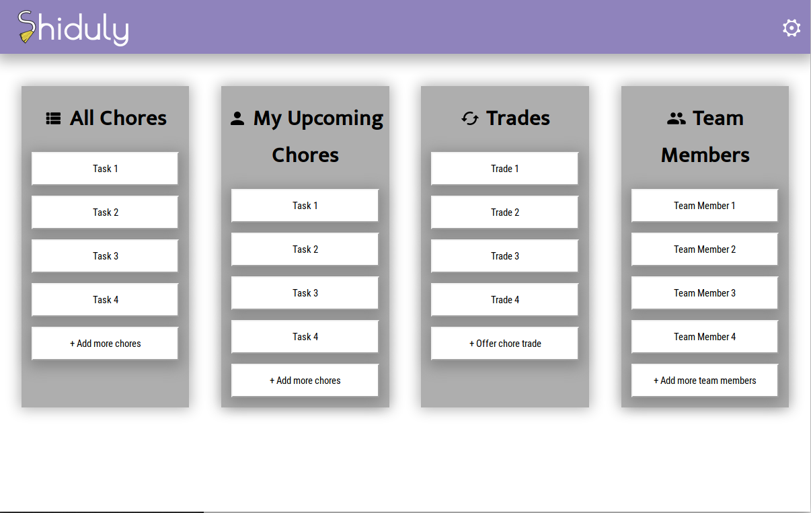
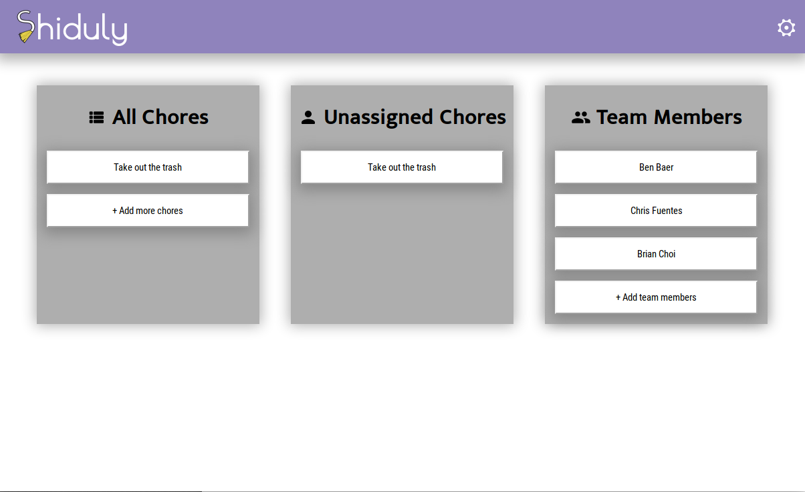

# Introduction

For many people living with roommates, especially for the first time, managing chores can be a daunting task. Often, roommates will just assume that other roommates will do a certain task, and when it inevitably doesn't get done, arguments tend to form. The purpose of Shiduly is to fix this. Shiduly is a chore-managing app that helps incentivize roommates to actually complete chores, and for roommates to understand what chores they need to do.

So, how can you make sure people are doing their fair share of chores? Well, automatic assignment based on time and severity of chores can certainly help. Shiduly's "killer feature" is that it will randomly and equally distribute chores amongst roommates. It will also use gamification to incentivize roommates to complete their chores on time. In order to make the app as widely-adopted as possible, we designed the User Interface carefully to make sure it's easy to use and friendly.

# User Interface

Our vision is that Shiduly would be hosted on a local smart-device in the house that the roommates live in. Roommates would add each other to the roommate database, and when walking up to the Shiduly panel, they "log in" by selecting themselves from a dropdown, and seeing their assigned chores in the **Assigned Chores** section. They can see which tasks are available, and take additional chores if they want to &mdash; with permission from the current task assignee, of course. Shiduly was designed to be simple to use, so we have very little in the way of content on the site. We only included what was absolutely necessary: Who the team members are, what the chores left to do are, and what chores are unassigned, or assigned to the user. We were originally inspired by more complex job-scheduling programs, but we quickly realized that a lot of the features that were included in these programs are simply unneccessary for our vision of Shiduly. 

\newpage

We wanted to make this lightweight, so it's easy to run on a low-cost, low-power device that could be mounted on a wall. In addition, we wanted to make it simple to use and touch-friendly. We decided on a more TweetDeck-like design for the design mockup

and further refined on this with our high-fidelity prototype.

\newpage

# Conclusion

Overall, the simple design we picked, along with making the application touch friendly, makes Shiduly a simple, easy-to-use application that can help a lot with keeping roommates chores in check.